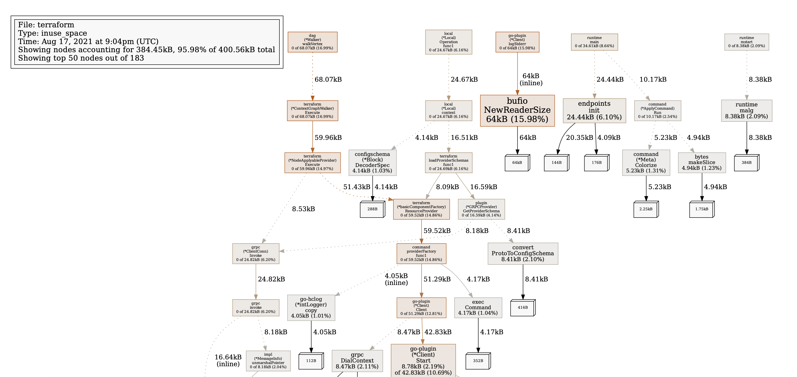

# Instructions for using Terraform Memory Profiler

## Prerequisites

You need to have `go` and `graphviz` installed locally. 


## Using the Profiler 

```
 $ export TF_LOG=INFO

 $ terraform apply -auto-approve
2021-08-17T21:04:58.580Z [INFO]  profile: memory profiling enabled (rate 4096), /tmp/profile029865585/mem.pprof
2021-08-17T21:04:58.580Z [INFO]  Terraform version: 1.0.4
2021-08-17T21:04:58.580Z [INFO]  Go runtime version: go1.15.2
2021-08-17T21:04:58.580Z [INFO]  CLI args: []string{"/root/code/go/bin/terraform", "apply", "-auto-approve"}
2021-08-17T21:04:58.582Z [INFO]  Loading CLI configuration from /root/.terraform.d/credentials.tfrc.json
2021-08-17T21:04:58.586Z [INFO]  CLI command args: []string{"apply", "-auto-approve"}
2021-08-17T21:04:58.660Z [INFO]  Failed to read plugin lock file .terraform/plugins/linux_amd64/lock.json: open .terraform/plugins/linux_amd64/lock.json: no such file or directory
2021-08-17T21:04:58.662Z [INFO]  backend/local: starting Apply operation
2021-08-17T21:04:58.691Z [INFO]  provider: configuring client automatic mTLS
2021-08-17T21:04:58.742Z [INFO]  provider.terraform-provider-random_v2.3.0_x4: configuring server automatic mTLS: timestamp=2021-08-17T21:04:58.741Z
2021-08-17T21:04:58.853Z [INFO]  terraform: building graph: GraphTypeValidate
2021-08-17T21:04:58.861Z [INFO]  provider: configuring client automatic mTLS
2021-08-17T21:04:58.917Z [INFO]  provider.terraform-provider-random_v2.3.0_x4: configuring server automatic mTLS: timestamp=2021-08-17T21:04:58.917Z
2021-08-17T21:04:59.023Z [INFO]  backend/local: apply calling Plan
2021-08-17T21:04:59.023Z [INFO]  terraform: building graph: GraphTypePlan
2021-08-17T21:04:59.028Z [INFO]  provider: configuring client automatic mTLS
2021-08-17T21:04:59.080Z [INFO]  provider.terraform-provider-random_v2.3.0_x4: configuring server automatic mTLS: timestamp=2021-08-17T21:04:59.080Z
2021-08-17T21:04:59.191Z [WARN]  Provider "registry.terraform.io/hashicorp/random" produced an invalid plan for random_string.resource_code, but we are tolerating it because it is using the legacy plugin SDK.
    The following problems may be the cause of any confusing errors from downstream operations:
      - .min_numeric: planned value cty.NumberIntVal(0) for a non-computed attribute
      - .number: planned value cty.True for a non-computed attribute
      - .lower: planned value cty.True for a non-computed attribute
      - .min_lower: planned value cty.NumberIntVal(0) for a non-computed attribute
      - .min_special: planned value cty.NumberIntVal(0) for a non-computed attribute
      - .min_upper: planned value cty.NumberIntVal(0) for a non-computed attribute

Terraform used the selected providers to generate the following execution plan. Resource actions are indicated with the following symbols:
  + create

Terraform will perform the following actions:

  # random_string.resource_code will be created
  + resource "random_string" "resource_code" {
      + id          = (known after apply)
      + length      = 5
      + lower       = true
      + min_lower   = 0
      + min_numeric = 0
      + min_special = 0
      + min_upper   = 0
      + number      = true
      + result      = (known after apply)
      + special     = false
      + upper       = false
    }

Plan: 1 to add, 0 to change, 0 to destroy.

Changes to Outputs:
  + resource_code = (known after apply)
2021-08-17T21:04:59.197Z [INFO]  backend/local: apply calling Apply
2021-08-17T21:04:59.197Z [INFO]  terraform: building graph: GraphTypeApply
2021-08-17T21:04:59.203Z [INFO]  provider: configuring client automatic mTLS
2021-08-17T21:04:59.251Z [INFO]  provider.terraform-provider-random_v2.3.0_x4: configuring server automatic mTLS: timestamp=2021-08-17T21:04:59.251Z
2021-08-17T21:04:59.348Z [WARN]  Provider "registry.terraform.io/hashicorp/random" produced an invalid plan for random_string.resource_code, but we are tolerating it because it is using the legacy plugin SDK.
    The following problems may be the cause of any confusing errors from downstream operations:
      - .min_special: planned value cty.NumberIntVal(0) for a non-computed attribute
      - .min_upper: planned value cty.NumberIntVal(0) for a non-computed attribute
      - .lower: planned value cty.True for a non-computed attribute
      - .min_lower: planned value cty.NumberIntVal(0) for a non-computed attribute
      - .min_numeric: planned value cty.NumberIntVal(0) for a non-computed attribute
      - .number: planned value cty.True for a non-computed attribute
random_string.resource_code: Creating...
2021-08-17T21:04:59.348Z [INFO]  Starting apply for random_string.resource_code
random_string.resource_code: Creation complete after 0s [id=nusyf]

Apply complete! Resources: 1 added, 0 changed, 0 destroyed.

Outputs:

resource_code = "nusyf"
2021-08-17T21:04:59.372Z [INFO]  profile: memory profiling disabled, /tmp/profile029865585/mem.pprof


$ go tool pprof --pdf /tmp/profile029865585/mem.pprof
Generating report in profile001.pdf

# This should output a PDF version of memory 
```

